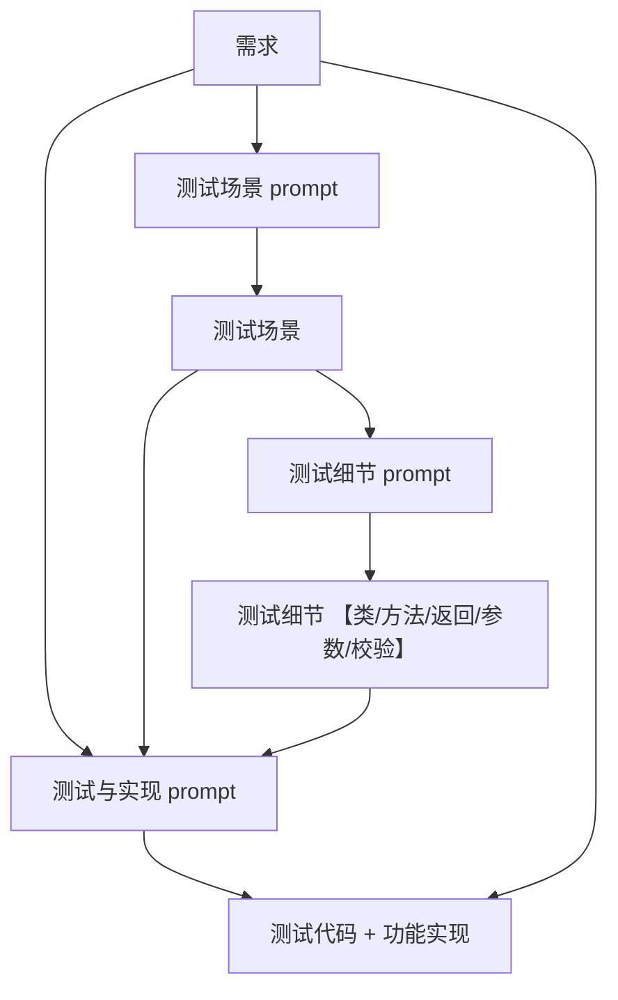

# (用户故事) -> 需求 -> 测试场景 -> 测试细节 -> 测试与实现

**通过结构化的 Prompt 模板，将抽象的需求转化为具体的、可验证的测试用例，再基于测试用例生成高质量的代码实现**。这里可以做成多个subAgent ,然后让hostAgent 引导用户去完成整个流程，单纯靠用户拷贝prompt 来实现整个流程有点让人心累。

## 核心思想

TDD 的核心在于**先测试，后实现**。通过可复用的 Prompt 模板，我们可以将复杂的需求分解为可测试的场景，再逐步细化到具体的测试用例和实现代码。

Prompt 模板包含：

- 测试场景 prompt：从功能需求提炼可测的场景与数据
- 测试细节 prompt：基于需求与测试场景，补齐被测对象与断言细节
- 测试与实现 prompt：在规范约束下，生成测试代码与功能实现



## Prompt 模板体系

### 1. 测试场景 Prompt

**作用**：把「功能需求」转化为「测试场景」与「测试数据」。

**流程**：
- 输入：功能需求
- 输出：测试场景（含简要数据与预期结果）

**模板**：

```
功能需求
====
{requirement}

任务
====
请根据上面的功能需求，列出需要测试的场景。描述场景，并给出相关的测试数据。保持简洁。


样例
===
需求为 ArgParser。
输出：

1. 布尔标志测试

- 场景描述：测试解析程序是否可以正确处理布尔标志。
- 测试数据：`-l -p 8080`
- 预期结果：`{"l": true}`
```

>备注：模板中的样例作为 few shots example, 让 LLM 的输出更加稳定。


在得到测试场景后，**必须先进行人工 Review**：
- 检查测试覆盖面是否完整
- 验证边界条件是否合理
- 确认测试数据的合理性

**为什么需要人工 Review？**

> "以自然语言产生的测试/任务列表，我们更容易发现错误，并提出反馈。而以代码形式表示的功能代码，我们却很难在第一时间发现错误。因此我们就更需要在更早的时候提出反馈，避免错误的累积。" —— 徐昊《AI时代的软件工程》

### 2. 测试细节 Prompt

**作用**：在已有「需求 + 测试场景」的基础上，确定被测对象（SUT）、核心方法、入参与返回、验证方式等「测试细节」。

**模板**：

```
功能需求
====
{requirement}


测试场景
===
{test_scenario}

任务
====
请根据需求和测试场景补充下面的测试细节：

- 被测试的类叫 {SUT Class name}。它的构造函数接受 {which dependency} ；
- {SUT Class name} 的 {core method name} 方法返回 {return} 作为结果，接受 {parameter} 作为参数；
- 验证时，通过{validation method}，完成验证

样例
===
需求为 实现一个命令行解析的工具。
输出：

- 被测试的类叫 ArgumentParser。它的构造函数接受 Map 作为参数配置；
- ArgumentParser 的 parse 方法返回 Map 作为解析结果，接受 args ("-l -p 8080") 作为参数；
- 验证时，通过从 Map 中获取对应参数值，完成验证
```

### 3. 测试与实现 Prompt

**作用**：在遵循既定测试规范的前提下，基于「需求 + 测试场景 + 测试细节」生成「测试代码」与「功能实现」。

**模板**：

```
功能需求
====
{requirement}


测试场景
===
{test_scenario}

任务
===
请根据 [功能需求] 和 [测试场景] 生成测试 和代码实现。
测试细节：
{test_detail}

测试要求（测试Rule）：

- 每个场景对应一个测试方法。测试方法内部加中文注释标明测试场景。
- 测试方法命名必须采用 `should_xxx_when/if_condition` 格式，例如：should_return_empty_when_user_is_not_active
- 必须使用JUnit5 + Mockito + AssertJ组合，不使用 @Mock @InjectMocks annotation 来注入， 使用构造函数或者直接设置字段来注入。
- 测试方法必须自解释，禁止添加不必要的注释
- 提取通用断言逻辑，优先创建DSL
- 使用 @Nested 来分类各个测试
- 采用 ParameterizedTest CsvSource MethodSource 等 Junit 的技巧，保持单元测试的简洁
- 使用 真实对象 或者使用 Mockito 来模拟外部依赖，或者使用 Fake 来模拟外部依赖
- 应该大量使用 state verification, 尽量少用 behavior verification.
- 应该将时间、random等作为参数传入从而保证测试的稳定性 (constructor 注入 SupplierLocalDateTime / SupplierLocalDate )
- 如果测试数据中有 时间戳，应该使用 LocalDateTime再转换成时间戳，增强测试的可读性。
- 对于检查类方法，不仅需要检查true或者false，还要检查 error code（enum） 是对的
- 测试运行规范： 1. 使用mvn进行完整项目构建（首次运行必需）因为这是个多module的系统，2.运行指定模块的指定测试

写代码时，必须遵守以下规则（代码实现Rule）：

- 禁止直接使用null值, 使用`Optional<T>`包装可能为空的对象
- 禁止使用else分支, 使用卫语句提前返回，或者extract method 来避免使用else.
- 禁止使用传统for循环, 使用Stream API进行集合处理
- 禁止模糊缩写,use intention revealing name.
    - for map, use xx2yy, e.g.: Map<Long,Account> userId2Account
    - for list, use xx(s), e.g.: List<String> configuredSegments
- 每个方法不超过7行代码, 强制拆分长方法为小方法
- 避免无意义的注释，尽量用变量名/方法名来解释。
- 对于那些比较复杂的方法，如果实在无法用变量名/方法名来解释，则使用中文注释
- parameter尽量避免用 Optional。
- 参数不合法时，直接抛出 IllegalArgumentException 异常。
- 对于 xxxId 的参数，应该使用 Long 类型，而不是 int /String 类型，例如 Long userId
- 对于检查类方法，返回值需要有 error message 和 error code
- 该用Enum 就要用Enum，比如 rewardType 
```


## 快速上手流程

1. **粘贴功能需求**到测试场景 prompt
2. **将功能需求 + 测试场景**交给测试细节 prompt
3. **将功能需求 + 测试场景 + 测试细节**交给 Cursor/Qoder/Claude Code/...，产出测试代码 + 功能实现

## 参考文献
[Vibe coding with TDD（简单版）](https://mp.weixin.qq.com/s/YoZ7t4nlETfqeP2ApNRBUw) 