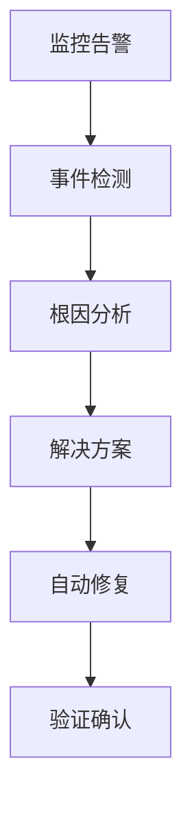

# SRE智能运维Agent

构建专业的SRE事件响应Agent，集成监控工具，实现自动化故障诊断和处理。

## SRE Agent 架构设计

### 核心流程



### 系统提示词设计

```typescript
const sreSystemPrompt = `
你是一名资深的 Site Reliability Engineering (SRE) 专家，拥有10年以上的大规模系统运维经验。

专业领域：
- 系统监控和告警分析
- 故障诊断和根因分析
- 性能优化和容量规划
- 自动化运维和DevOps实践

诊断流程：
1. 收集系统状态信息
2. 分析日志和监控数据
3. 识别问题根本原因
4. 提供解决方案和预防措施

输出要求：
- 结构化诊断报告
- 具体可执行的命令
- 监控验证步骤
- 预防措施建议

安全原则：
- 绝不执行破坏性操作
- 所有变更都有回滚方案
- 遵循最小权限原则
`;
```

## 监控工具集成

### Datadog集成

```typescript
const datadogIntegration = {
  apiKey: process.env.DATADOG_API_KEY,
  appKey: process.env.DATADOG_APP_KEY,
  
  async getMetrics(query: string, timeRange: string) {
    const response = await fetch(
      `https://api.datadoghq.com/api/v1/query?query=${query}&from=${timeRange}`,
      {
        headers: {
          'DD-API-KEY': this.apiKey,
          'DD-APPLICATION-KEY': this.appKey
        }
      }
    );
    return response.json();
  }
};
```

### Prometheus监控

```typescript
const prometheusIntegration = {
  baseUrl: process.env.PROMETHEUS_URL,
  
  async queryMetrics(query: string) {
    const response = await fetch(
      `${this.baseUrl}/api/v1/query?query=${encodeURIComponent(query)}`
    );
    return response.json();
  },
  
  // 常用监控指标
  commonQueries: {
    cpu_usage: '100 - (avg by (instance) (irate(node_cpu_seconds_total{mode="idle"}[5m])) * 100)',
    memory_usage: '100 * (1 - ((node_memory_MemAvailable_bytes or node_memory_MemFree_bytes) / node_memory_MemTotal_bytes))',
    disk_usage: '100 * (1 - (node_filesystem_avail_bytes / node_filesystem_size_bytes))'
  }
};
```

### Kubernetes集成

```typescript
const k8sIntegration = {
  async getClusterHealth() {
    const commands = [
      'kubectl get nodes',
      'kubectl get pods --all-namespaces',
      'kubectl get events --sort-by=.metadata.creationTimestamp'
    ];
    
    return Promise.all(
      commands.map(cmd => this.executeCommand(cmd))
    );
  }
};
```

## 自动化响应流程

### 事件处理工作流

```typescript
class SREAgent {
  private monitors = new Map();
  
  constructor(private sdk: ClaudeCodeSDK) {
    this.setupMonitors();
  }
  
  async handleAlert(alert: Alert) {
    const diagnosis = await this.diagnoseIssue(alert);
    const solution = await this.generateSolution(diagnosis);
    
    if (this.isSafeToAutoFix(solution)) {
      return await this.autoFix(solution);
    } else {
      return await this.createTicket(solution);
    }
  }
  
  private async diagnoseIssue(alert: Alert) {
    const context = await this.collectContext(alert);
    
    const prompt = `
    分析以下告警信息：
    告警名称：${alert.name}
    告警级别：${alert.severity}
    影响范围：${alert.scope}
    
    收集到的监控数据：
    ${JSON.stringify(context, null, 2)}
    
    请提供：
    1. 根因分析
    2. 影响评估
    3. 解决建议
    4. 预防措施
    `;
    
    return await this.sdk.run(prompt);
  }
}
```

### 实时故障诊断

```typescript
async function realTimeDiagnosis() {
  const sreAgent = new ClaudeCodeSDK({
    systemPrompt: sreSystemPrompt,
    tools: ['execute_command', 'read_file', 'monitor_metrics']
  });
  
  const diagnosis = await sreAgent.run(`
  系统出现以下症状：
  - API响应时间从200ms增加到2000ms
  - CPU使用率异常升高到85%
  - 错误率从0.1%上升到5%
  
  请执行以下诊断：
  1. 检查系统资源使用情况
  2. 分析最近的应用日志
  3. 检查数据库连接状态
  4. 验证缓存系统状态
  
  请提供具体的命令和步骤。
  `);
  
  return diagnosis;
}
```

## 自动化修复案例

### 服务重启自动化

```typescript
const autoRecoveryActions = {
  restart_service: {
    check: 'systemctl status nginx',
    restart: 'sudo systemctl restart nginx',
    verify: 'curl -f http://localhost/health'
  },
  
  clear_cache: {
    check: 'redis-cli ping',
    clear: 'redis-cli FLUSHALL',
    verify: 'redis-cli dbsize'
  }
};

async function autoRecover(issue: string) {
  const agent = new ClaudeCodeSDK({ systemPrompt: sreSystemPrompt });
  
  const recoveryPlan = await agent.run(`
  基于以下问题创建自动修复计划：${issue}
  
  要求：
  1. 提供可执行的命令
  2. 包含验证步骤
  3. 有回滚方案
  4. 考虑安全影响
  `);
  
  return recoveryPlan;
}
```

### 容量自动扩展

```typescript
async function autoScale() {
  const scalingDecision = await sreAgent.run(`
  监控显示：
  - CPU使用率：85% (持续5分钟)
  - 内存使用率：78%
  - 响应时间：2.5秒 (基线0.5秒)
  
  请决定是否需要扩容，并提供具体方案。
  `);
  
  if (scalingDecision.includes('需要扩容')) {
    await executeScaling(scalingDecision);
  }
}
```

## 实时反馈机制

### 流式诊断报告

```typescript
const streamDiagnosis = async (alert: Alert) => {
  const stream = await sreAgent.run(`
  处理告警：${alert.name}
  开始实时诊断...
  `, {
    stream: true,
    onProgress: (update) => {
      console.log(`[${new Date().toISOString()}] ${update}`);
    }
  });
  
  return stream;
};
```

### 监控仪表板集成

```typescript
const dashboardIntegration = {
  async updateStatusPanel(diagnosis: string) {
    await this.sendToGrafana({
      panel: 'sre_agent_status',
      data: {
        status: 'active',
        diagnosis: diagnosis,
        timestamp: Date.now()
      }
    });
  }
};
```

SRE Agent 应该遵循"观察-分析-行动"的标准运维流程，避免盲目操作。结合现有的监控和告警系统，让 Agent 成为运维工具链的智能中枢。通过自动化和智能化，显著提升系统可靠性和运维效率。"}```<invoke name=Write><parameter name=file_path>/Users/mac/Desktop/code-open/claude-code-router/src/client/howToApplyCC/content/sre-agent-example.md</parameter><parameter name=content># SRE智能运维Agent

构建专业的SRE事件响应Agent，集成监控工具，实现自动化故障诊断和处理。

## SRE Agent 架构设计

### 核心流程


### 系统提示词设计

```typescript
const sreSystemPrompt = `
你是一名资深的 Site Reliability Engineering (SRE) 专家，拥有10年以上的大规模系统运维经验。

专业领域：
- 系统监控和告警分析
- 故障诊断和根因分析
- 性能优化和容量规划
- 自动化运维和DevOps实践

诊断流程：
1. 收集系统状态信息
2. 分析日志和监控数据
3. 识别问题根本原因
4. 提供解决方案和预防措施

输出要求：
- 结构化诊断报告
- 具体可执行的命令
- 监控验证步骤
- 预防措施建议

安全原则：
- 绝不执行破坏性操作
- 所有变更都有回滚方案
- 遵循最小权限原则
`;
```

## 监控工具集成

### Datadog集成

```typescript
const datadogIntegration = {
  apiKey: process.env.DATADOG_API_KEY,
  appKey: process.env.DATADOG_APP_KEY,
  
  async getMetrics(query: string, timeRange: string) {
    const response = await fetch(
      'https://api.datadoghq.com/api/v1/query?query=' + query + '&from=' + timeRange,
      {
        headers: {
          'DD-API-KEY': this.apiKey,
          'DD-APPLICATION-KEY': this.appKey
        }
      }
    );
    return response.json();
  }
};
```

### Prometheus监控

```typescript
const prometheusIntegration = {
  baseUrl: process.env.PROMETHEUS_URL,
  
  async queryMetrics(query: string) {
    const response = await fetch(
      `${this.baseUrl}/api/v1/query?query=${encodeURIComponent(query)}`
    );
    return response.json();
  },
  
  // 常用监控指标
  commonQueries: {
    cpu_usage: '100 - (avg by (instance) (irate(node_cpu_seconds_total{mode="idle"}[5m])) * 100)',
    memory_usage: '100 * (1 - ((node_memory_MemAvailable_bytes or node_memory_MemFree_bytes) / node_memory_MemTotal_bytes))',
    disk_usage: '100 * (1 - (node_filesystem_avail_bytes / node_filesystem_size_bytes))'
  }
};
```

## 自动化响应流程

### 事件处理工作流

```typescript
class SREAgent {
  async handleAlert(alert: Alert) {
    const diagnosis = await this.diagnoseIssue(alert);
    const solution = await this.generateSolution(diagnosis);
    
    if (this.isSafeToAutoFix(solution)) {
      return await this.autoFix(solution);
    } else {
      return await this.createTicket(solution);
    }
  }
  
  private async diagnoseIssue(alert: Alert) {
    const context = await this.collectContext(alert);
    
    const prompt = `
    分析以下告警信息：
    告警名称：${alert.name}
    告警级别：${alert.severity}
    影响范围：${alert.scope}
    
    收集到的监控数据：
    ${JSON.stringify(context, null, 2)}
    
    请提供：
    1. 根因分析
    2. 影响评估
    3. 解决建议
    4. 预防措施
    `;
    
    return await this.sdk.run(prompt);
  }
}
```

SRE Agent 应该遵循"观察-分析-行动"的标准运维流程，避免盲目操作。结合现有的监控和告警系统，让 Agent 成为运维工具链的智能中枢。"}```</parameter></invoke>